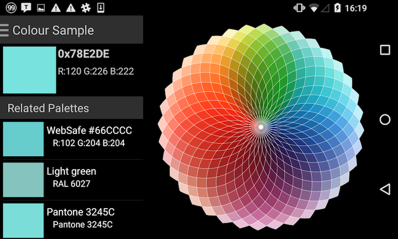
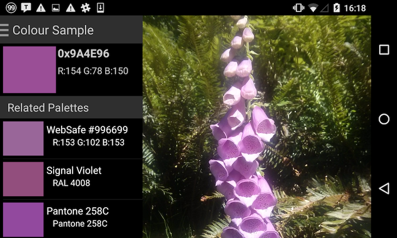
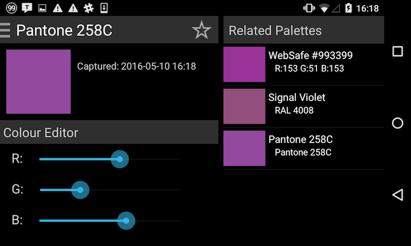
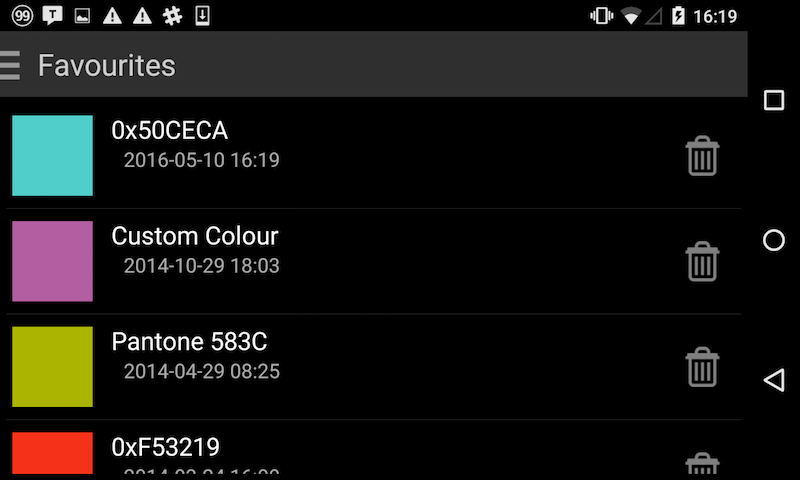
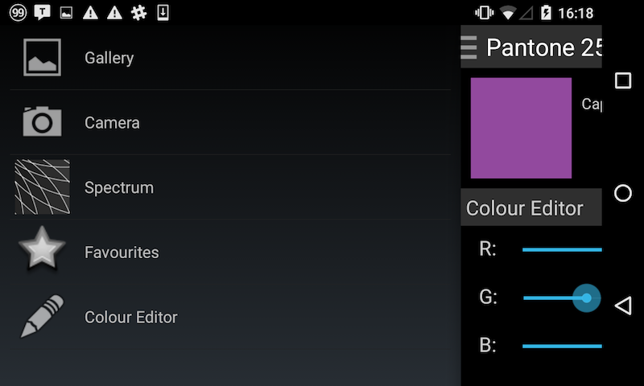

# EyeDropper - Colour Sampler

This is a native Android application designed to identify colours and translate them to machine-readable code. Ideal for persons with visual impairments, and to assist web developers, interior designers, architects to match colour palettes.

## Features

The image input modes include:

* Read image from device gallery
* Capture photo for colour analysis
* Colour spectrum

### Colour Matching

A selected colour is automatically matched to the nearest Web-Safe colour as well as standard colour palettes [Pantone](https://en.wikipedia.org/wiki/Pantone) and [RAL](https://en.wikipedia.org/wiki/RAL_colour_standard)).

### Colour Editor

The **colour editor** makes adjustments to any selected colour by manipulating RGB channels. You can also save your favourite colours for future reference.

## Dependencies

    * [PhotoView](https://github.com/JakeWharton/ActionBarSherlock) - aims to help produce an easily usable implementation of a zooming Android ImageView.
    * [SlidingMenu](https://github.com/jfeinstein10/SlidingMenu) - allows developers to easily create applications with sliding menus
    * [ActionBarSherlock](https://github.com/JakeWharton/ActionBarSherlock) - a standalone library designed to facilitate the use of the action bar design pattern across all versions of Android through a single API.

## Pantone Color Resources

    * http://www.umsiko.co.za/links/color.html
    * http://goffgrafix.com/pantone-rgb-100.php
    * http://www.labelpartners.com/pantone_coated_table.html

## RAL Color Resources
    
    * http://www.ralcolor.com/
    * http://ralcolor.net/
    * http://ralcolors.net/

